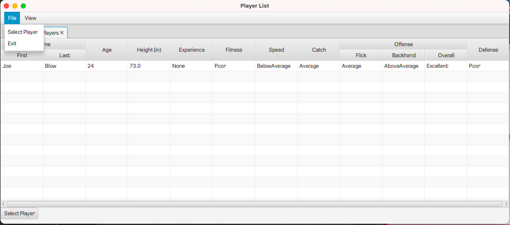
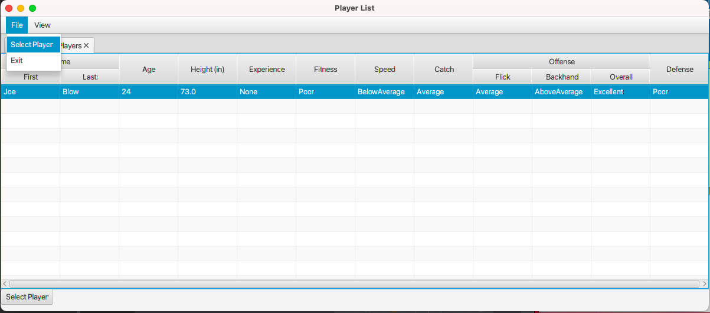

# Ultimate Draft Organizer

## Synopsis
This program allow a user to run an Ultimate Draft over a network for picking players for teams. The server allows players to be added to a master list, and the client allows a captain to select players and view the players on their team.

## Motivation
This program was created to help users pick teams over long distances. This program can also help users to compare the stats of all players to help them create the best team.

## How to Run
The program is written using JavaFX. It can be run in an IDE that supports JavaFX.
There is a button to create a demo player to show the functionality of the program.
Below are some pictures of the program running and how it works.


<br>
<em>This is the Server window. From the server, a user can add players to the pool of all players. A demo player is shown above.</em>

<br>
<br>
<br>


<br>
<em>Client Window: This is the list of all Players that can be found in the client window. Any players added from the server will appear here.</em>

<br>
<br>
<br>



<br>
<em>File Menu: From the file menu on the client a player can be selected to play on a team. The player must first be selected in the All Players tab. Then, the player will be added to the Team List tab and removed from the All Players tab.</em>

<br>
<br>
<br>


<br>
<em>View Menu: From this menu a player can view a list of all players, the list of team players, or a player's stats.</em>

<br>
<br>
<br>


<br>
<em>View Player info: In order to view a player's stats, the player must be selected under the Team List tab. The player's stats will appear in a new tab. </em>

<br>
<br>
<br>


<br>
<em>Player Stats: This tab shows the stats of the player who was highlighted under the Team List tab.</em>

<br>
<br>
<br>


## Code Example
This code shows a thread that was created on the client class to accept information from the server class.
```
		new Thread(()->{
			try {
				Socket socket = new Socket("localhost", 8000);

				BufferedReader fromServer = new BufferedReader(new InputStreamReader(socket.getInputStream()));
				while(true) {
					try {						
					 Player player= new Player(
						fromServer.readLine(),
						fromServer.readLine(),
						Integer.parseInt(removeNull(fromServer.readLine())),
						Double.parseDouble(removeNull(fromServer.readLine())),
						Player.ExperienceLevel.values()[Integer.parseInt(removeNull(fromServer.readLine()))],
						Player.Ability.values()[Integer.parseInt(removeNull(fromServer.readLine()))],  
						Player.Ability.values()[Integer.parseInt(removeNull(fromServer.readLine()))],
						Player.Ability.values()[Integer.parseInt(removeNull(fromServer.readLine()))],
						Player.Ability.values()[Integer.parseInt(removeNull(fromServer.readLine()))],
						Player.Ability.values()[Integer.parseInt(removeNull(fromServer.readLine()))],
						Player.Ability.values()[Integer.parseInt(removeNull(fromServer.readLine()))],
						Player.Ability.values()[Integer.parseInt(removeNull(fromServer.readLine()))],
						fromServer.readLine());
						
						olAllPlayers.add(player);
						
						
						
						Platform.runLater(()->{							
							tabPane.getTabs().remove(tabAllPlayers);
							tabPane.getTabs().add(tabAllPlayers);
						});
					} 
					catch (IOException e1) {
						e1.printStackTrace();
					}
				}
			}

			catch(IOException ex) {
				ex.printStackTrace();
			}

		}).start();
